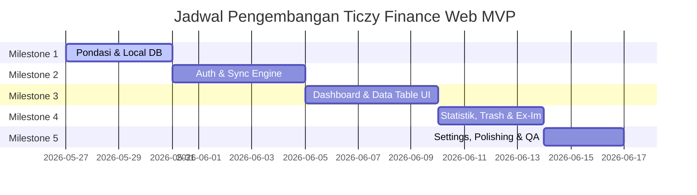

# RANCANGAN & MILESTONE MVP: TICZY FINANCE WEB

Dokumen ini mendefinisikan rencana kerja (*milestone*) pembangunan versi **Web MVP (Minimum Viable Product)** untuk **Ticzy Finance** berdasarkan analisis spesifikasi aplikasi mobile (Flutter) yang tertuang dalam [Spesifikasi Ticzy Finance.md](file:///e:/PROJECT/PARZELLO/ticzy-web/Planning/Spesifikasi%20Ticzy%20Finance.md).

Pengembangan versi web ini akan sepenuhnya menggunakan **sistem gaya (style system) yang sudah ada** di proyek Next.js ini, yaitu **Tailwind CSS v4** dengan **shadcn/ui** dan **Tabler Icons** untuk menjaga konsistensi visual modern dan premium (dark mode, layout @container, smooth transitions).

---

## 1. STRATEGI ARSITEKTUR WEB (ADAPTASI OFFLINE-FIRST)

Aplikasi mobile Ticzy Finance menggunakan SQLite (`sqflite`) dan Supabase Cloud. Untuk versi Web, arsitektur *Offline-First* ini akan diadaptasikan menggunakan padanan teknologi web modern berikut:

```
+--------------------------------------------------------------------------+
|                     Next.js Web UI (React + shadcn/ui)                    |
+--------------------------------------------------------------------------+
                                     |
                 +-------------------+-------------------+
                 | (Offline & Instant)                   | (Online & Auth)
                 v                                       v
+----------------------------------+       +-------------------------------+
| IndexedDB Lokal (via Dexie.js)   |       | Supabase Cloud API            |
| - Skema tabel & relasi presisi   | <---> | - SyncEngine batching per 50  |
| - Penanda is_synced & is_deleted |       | - RLS & PostgreSQL Database   |
+----------------------------------+       +-------------------------------+
```

1. **Local Offline Engine**: Menggunakan **IndexedDB** melalui pustaka **Dexie.js** (wrapper IndexedDB paling ringan dan bertipe data kuat). Ini secara sempurna menduplikasi fungsionalitas SQLite lokal pada Flutter.
2. **Cloud Sync Engine**: Menjalankan fungsi sinkronisasi latar belakang (*background sync* atau sinkronisasi terjadwal/manual) dengan **Supabase REST API** untuk melakukan *upsert* data massal (batching per 50 data) berbasis kolom `is_synced`.
3. **Authentication**: Menggunakan **Supabase Auth** untuk integrasi Google Sign-In (OAuth) dan Guest Session (menyimpan data secara lokal sebelum migrasi).

---

## 2. ADAPTASI HALAMAN & KOMPONEN (MOBILE -> WEB SHADCN)

Sebanyak 14 halaman pada versi mobile akan disederhanakan dan dikelompokkan ke dalam layout web dashboard yang responsif dan elegan:

### A. Struktur Navigasi & Layout Utama (`/dashboard`)
*   **Sidebar (`components/app-sidebar.tsx`)**: Menampilkan **Buku Catatan Aktif (Book Switcher)** di bagian atas, menu utama (`navMain`), perpustakaan dokumen/laporan (`documents`), status sinkronisasi *realtime* (indikator hijau/merah), tombol pemicu sinkronisasi manual, dan info profil pengguna (`nav-user`) di footer.
*   **Site Header (`components/site-header.tsx`)**: Dilengkapi dengan breadcrumbs dinamis dan tombol pintas aksi cepat (misalnya: *Tambah Transaksi*).

### B. Pemetaan Halaman / Halaman Rute Next.js

| No | Halaman Web | Rute Next.js | Komponen shadcn/ui Utama |
| :--- | :--- | :--- | :--- |
| 1 | **Login & Onboarding** | `/` atau `/login` | `Card`, `Button`, `Carousel` (untuk onboard slide), tab login. |
| 2 | **Dashboard / Home** | `/dashboard` | `SidebarProvider`, `SectionCards` (total balance, cash flow), `ChartAreaInteractive`, dan `DataTable` (transaksi terbaru). |
| 3 | **Kelola Buku (Multi-Book)**| `/dashboard/books` | `Dialog` untuk tambah/edit buku, color seed picker, dan visual icon selector. |
| 4 | **Rekap Keuangan** | `/dashboard/rekap` | `Tabs`, `Accordion` bulanan, dan interaktif `recharts` (Area/Bar Chart). |
| 5 | **Similar Transactions** | `/dashboard/similar` | `DataTable` dengan pengelompokan baris (row grouping) berdasarkan deskripsi, dan tombol bulk-delete. |
| 6 | **Keranjang Sampah** | `/dashboard/trash` | `Table` untuk soft-deleted books dengan validasi limitasi pulihkan (Free vs Premium). |
| 7 | **Settings & Preferences** | `/dashboard/settings` | `Switch` (dark mode), `Select` (bahasa), `RadioGroup` (accent color). |
| 8 | **Export / Import** | `/dashboard/export` | `Card`, input file picker, pratinjau JSON sebelum diimpor (`Import Review`). |

---

## 3. SKEMA DATABASE DI WEB (INDEXEDDB LOKAL & SUPABASE CLOUD)

Struktur tabel di IndexedDB akan menduplikasi schema SQLite agar proses sinkronisasi Supabase dapat berjalan secara dua arah tanpa konflik skema data.

### A. Tabel `books`
```typescript
{
  id: "string (UUID) [Primary Key]",
  user_id: "string (Nullable)",
  name: "string",
  description: "string (Nullable)",
  color: "number (HEX/ARGB)",
  icon: "string",
  created_at: "string (ISO8601)",
  updated_at: "string (ISO8601)",
  is_synced: "number (0 | 1)",
  is_deleted: "number (0 | 1)"
}
```

### B. Tabel `transactions`
```typescript
{
  id: "string (UUID) [Primary Key]",
  user_id: "string (Nullable)",
  transaction_date: "string (ISO8601)",
  description: "string (Nullable)",
  amount: "number (Double)",
  type: "string ('income' | 'expense')",
  book_id: "string [Foreign Key -> books.id]",
  is_synced: "number (0 | 1)",
  is_deleted: "number (0 | 1)"
}
```

---

## 4. MILESTONE PENGEMBANGAN MVP (ESTIMASI 5 SIKLUS SPRINT)

Berikut adalah rencana milestone bertahap untuk membangun MVP versi Web tanpa mengubah sistem gaya yang sudah ada:



### MILESTONE 1: Pondasi & Manajemen State Lokal (Offline-First Basis)
*   **Tujuan**: Membangun mesin database lokal di browser dan manajemen status reaktif global.
*   **Daftar Tugas**:
    1. `[ ]` Instalasi dependensi baru: `dexie` dan `dexie-react-hooks`.
    2. `[ ]` Membuat berkas konfigurasi IndexedDB `lib/db.ts` dengan schema `books` dan `transactions`.
    3. `[ ]` Membuat helper CRUD (Create, Read, Update, Delete) lokal untuk manipulasi data instan.
    4. `[ ]` Integrasi manajemen state global (misalnya menggunakan React Context atau Zustand) untuk melacak Buku yang Aktif secara global (`activeBookId`).
*   **Kriteria Selesai**: Aplikasi web dapat dijalankan dan mampu melakukan penyimpanan data buku & transaksi ke IndexedDB browser secara lokal, instan, dan persisten (data tidak hilang saat di-refresh).

### MILESTONE 2: Integrasi Cloud (Supabase) & Sync Engine
*   **Tujuan**: Mengaktifkan sinkronisasi otomatis lokal-ke-cloud dua arah serta penanganan login user.
*   **Daftar Tugas**:
    1. `[ ]` Setup konfigurasi client Supabase di `lib/supabase.ts` menggunakan *environment variables*.
    2. `[ ]` Membuat modul sinkronisasi `lib/sync.ts` dengan fungsionalitas:
        *   **Push**: Mendorong data dengan `is_synced = 0` secara berkelompok (batching 50 item) ke Supabase.
        *   **Pull**: Mengunduh data terbaru dari Supabase dan memperbarui IndexedDB lokal dengan taktik *Conflict Overwrite* (data terbaru menang).
        *   **Soft-delete handling**: Mendorong penghapusan ke Cloud terlebih dahulu sebelum menghapus baris dari IndexedDB lokal.
    3. `[ ]` Implementasi fitur **Guest to User Migration**: Logika otomatis yang mengunggah seluruh buku dan transaksi tamu (Guest) ke Supabase setelah pengguna sukses masuk menggunakan akun Google.
    4. `[ ]` Integrasi Supabase Auth di halaman Login (`/login`) dengan UI shadcn elegan.
*   **Kriteria Selesai**: Pengguna dapat masuk menggunakan Google. Data lokal Guest berhasil bermigrasi secara otomatis saat login pertama kali, dan sinkronisasi data ke database PostgreSQL Supabase berjalan sukses di balik layar.

### MILESTONE 3: Pembangunan Core Dashboard & Data Table UI
*   **Tujuan**: Membuat antarmuka pengguna utama dengan widget transaksi, multi-book switcher, dan tabel interaktif yang premium.
*   **Daftar Tugas**:
    1. `[ ]` Kustomisasi Sidebar (`components/app-sidebar.tsx`) untuk mendukung pemilihan buku dinamis, badge status sinkronisasi, dan tombol pemicu sinkronisasi manual.
    2. `[ ]` Modifikasi `components/section-cards.tsx` untuk menampilkan:
        *   Total Saldo Buku Aktif
        *   Total Pemasukan Bulan Ini
        *   Total Pengeluaran Bulan Ini
        *   Selisih Bersih (Cash Flow)
    3. `[ ]` Integrasi lembar tambah transaksi instan menggunakan shadcn `Dialog` atau `Drawer` responsif (meniru WoltModalSheet di Flutter).
    4. `[ ]` Mengadaptasi `components/data-table.tsx` untuk memuat transaksi riil dari IndexedDB, mendukung penapisan (filter) berdasarkan tanggal/tipe, serta multi-select untuk penghapusan/edit massal (*batch operations*).
*   **Kriteria Selesai**: Dasbor utama menampilkan data riil dari buku yang dipilih. Pengguna dapat menambah, mengedit, memfilter, dan melakukan operasi massal pada transaksi secara visual.

### MILESTONE 4: Fitur Lanjutan (Statistik, Trash, & Ekspor-Impor)
*   **Tujuan**: Menyelesaikan fitur analitis keuangan, pemulihan data, serta portabilitas data cadangan.
*   **Daftar Tugas**:
    1. `[ ]` Membangun halaman **Rekap Keuangan** (`/dashboard/rekap`) menggunakan grafik area/batang interaktif dari recharts (`components/chart-area-interactive.tsx`) untuk melacak performa keuangan 6 bulan terakhir.
    2. `[ ]` Membuat halaman **Similar Transactions** (`/dashboard/similar`) untuk mencari pencatatan ganda atau pengeluaran berulang dengan deskripsi yang sama.
    3. `[ ]` Mengimplementasikan **Trash Page** (`/dashboard/trash`) untuk memulihkan buku berstatus `is_deleted = 1` dengan pengecekan batas (maksimal 2 buku aktif untuk pengguna non-premium).
    4. `[ ]` Membuat modul **Export & Import Review**:
        *   Ekspor data menjadi file `.json` terunduh.
        *   Halaman tinjauan impor (`Import Review`) yang memvalidasi data JSON sebelum ditulis ke database IndexedDB.
*   **Kriteria Selesai**: Grafik analitis keuangan menyajikan data dengan akurat, keranjang sampah bekerja sesuai skema soft-delete, dan file JSON ekspor-impor dapat dipulihkan dengan aman.

### MILESTONE 5: Preferensi, Polishing Visual, & QA Offline
*   **Tujuan**: Menyempurnakan preferensi tema dasar, lokalisasi bahasa, transisi animasi, serta pengujian ketahanan offline.
*   **Daftar Tugas**:
    1. `[ ]` Menyesuaikan halaman **Settings** (`/dashboard/settings`):
        *   Saklar tema gelap/terang instan (`next-themes`).
        *   Color Seed Picker: mengubah variabel warna aksen dasar (variabel `--primary` oklch di `app/globals.css` secara dinamis melalui gaya CSS).
        *   Pilihan bahasa (ID / EN) menggunakan konteks lokalisasi sederhana.
    2. `[ ]` Menambahkan efek micro-animations pada tombol transaksi dan loading state.
    3. `[ ]` **Offline QA Audit**:
        *   Menguji aplikasi dalam kondisi "Offline" (Network Throttling -> Offline di Chrome DevTools). Memastikan entri data tetap instan dan lancar.
        *   Mengaktifkan kembali koneksi internet dan menguji apakah Sync Engine secara otomatis mengirimkan antrean data yang belum disinkronkan ke Supabase.
*   **Kriteria Selesai**: Dasbor web terasa sangat hidup, warna aksen dapat disesuaikan, aplikasi bekerja 100% lancar saat luring (offline), dan sinkronisasi otomatis menyelaraskan data dengan sempurna begitu daring (online) kembali.

---

## 5. REKOMENDASI PENGEMBANGAN PREMIUM (DI LUAR MVP)

Untuk membuat versi web ini terasa jauh lebih premium dan memukau pengguna, berikut beberapa rekomendasi tambahan yang dapat diimplementasikan:
1.  **Glassmorphic Design Enhancement**: Menambahkan efek blur latar belakang pada komponen `Sidebar` dan `Dialog` ketika tema gelap diaktifkan guna memberikan impresi visual kedalaman yang mewah.
2.  **Visual Keyboard Shortcuts**: Memungkinkan pencatatan secepat kilat dengan menekan tombol pintas papan ketik (misal: `N` untuk transaksi baru, `B` untuk ganti buku) yang cocok bagi pengguna desktop power-user.
3.  **Supabase Realtime Shared Books**: Jika fitur "Shared Books" dari peta jalan mobile dirilis, versi web dapat secara langsung mendengarkan saluran realtime Supabase dan memperbarui data IndexedDB lokal secara instan tanpa perlu refresh halaman.
