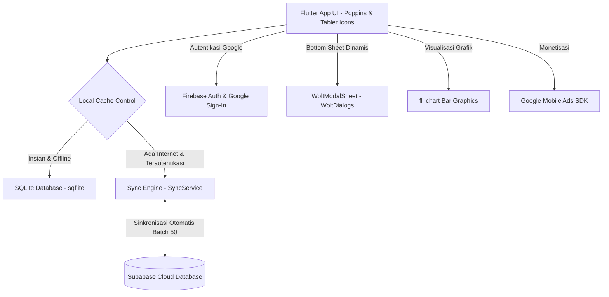

# SPESIFIKASI SISTEM: TICZY FINANCE
*Aplikasi Catat Keuangan Pintar - Offline-First dengan Sinkronisasi Cloud Otomatis*

---

## 1. PENDAHULUAN & RINGKASAN EKSEKUTIF

### Deskripsi Singkat
**Ticzy Finance** adalah aplikasi pencatatan keuangan pribadi dan bisnis berbasis mobile yang mengusung konsep **Offline-First**. Aplikasi ini dirancang untuk memberikan pengalaman pencatatan yang sangat responsif, lancar, dan tanpa gangguan jaringan internet. Semua data disimpan secara lokal pada perangkat pengguna dan secara otomatis disinkronisasikan ke database cloud aman saat koneksi internet tersedia dan pengguna telah terautentikasi.

### Tujuan Utama Sistem
1. **Kecepatan Pencatatan (Performa Instan)**: Mencegah *loading lag* dengan menggunakan mesin basis data lokal SQLite sebagai media penyimpanan utama.
2. **Pemisahan Entitas Keuangan**: Memungkinkan pengguna memisahkan pengeluaran/pemasukan berdasarkan konteks (misalnya: pribadi, bisnis, proyek, tabungan) melalui fitur multi-buku keuangan (*Multi-Book*).
3. **Analisis Finansial yang Kaya**: Menyediakan laporan ringkas per bulan, visualisasi grafik interaktif, dan deteksi otomatis pengeluaran berulang.
4. **Keamanan & Portabilitas Data**: Integrasi autentikasi Google, backup otomatis ke Supabase Cloud, serta fitur ekspor-impor data mandiri berbasis file JSON.

---

## 2. ARSITEKTUR TEKNOLOGI & DEPENDENSI UTAMA

Sistem Ticzy Finance dibangun menggunakan kombinasi pustaka modern untuk memberikan visual premium dan kestabilan sistem:

### Stack Detail:
*   **Framework UI**: Flutter (Dart) - Menggunakan Material 3 dengan tipografi **Google Fonts (Poppins)** dan aset ikon modern dari **Tabler Icons**.
*   **Offline Storage**: SQLite (`sqflite` & `path`) - Mesin database relasional lokal dengan sistem migrasi schema otomatis terintegrasi (saat ini menggunakan basis versi 5).
*   **Cloud Backend**: **Supabase** (`supabase_flutter`) - Menyediakan PostgreSQL Cloud untuk penyimpanan data, autentikasi terpusat, dan aturan keamanan tabel (*Row Level Security* / RLS).
*   **Authentication**: Google Sign-In terintegrasi dengan **Firebase Core** & Supabase.
*   **Visual Laporan**: **fl_chart** - Menggambar grafik batang (*bar chart*) interaktif pemasukan vs pengeluaran.
*   **Ad Server**: **Google Mobile Ads** - Monetisasi iklan banner terintegrasi (`AdBanner` & `NativeAdWidget`).
*   **Dialog & Sheets**: **WoltModalSheet** - Menghasilkan interaksi popup yang mengalir lancar dan modern untuk pengeditan dan konfirmasi.

---

## 3. SPESIFIKASI JUMLAH HALAMAN (SCREENS)

Berdasarkan hasil analisis menyeluruh dari struktur direktori `lib/PAGES/`, `lib/AUTH/`, dan kontainer utama, sistem Ticzy Finance memiliki **total 14 Halaman / Screen** yang terintegrasi:

### Tabel Ringkasan Halaman

| No | Nama Halaman | Nama File / Komponen | Deskripsi Singkat | Fitur Utama |
| :--- | :--- | :--- | :--- | :--- |
| 1 | **Onboarding Page** | `onboarding_page.dart` | Tampilan pengenalan aplikasi saat pertama kali dibuka. | `PageView` 3 slide interaktif, page indicator animasi, tombol lewati. |
| 2 | **Login Page** | `login_page.dart` | Gerbang autentikasi pengguna. | Tombol "Masuk dengan Google", opsi "Masuk sebagai Guest". |
| 3 | **Dashboard / Home** | `homepage.dart` | Pusat pemantauan saldo dan transaksi aktif. | Total saldo (bisa disembunyikan), pintasan Smart Insight/Share Finance, period selector horizontal, list transaksi harian. |
| 4 | **Drawer Navigation**| `Drawer.dart` | Menu samping geser untuk akses global. | Info profil & premium badge, book switcher, status sinkronisasi realtime, indikator online/offline, tombol sync manual. |
| 5 | **Book List Page** | `book_list_page.dart` | Halaman kelola buku catatan keuangan. | Tambah buku (warna + ikon kustom), edit, dan hapus buku. |
| 6 | **Rekap Keuangan** | `rekap_keuangan_page.dart`| Pusat laporan statistik bulanan. | Grafik batang 6 bulan terakhir (`fl_chart`), accordion detail per bulan, akumulasi sisa saldo. |
| 7 | **Export Page** | `export_page.dart` | Fasilitas ekspor data kustom. | Pilihan ekspor (semua, harian, bulanan, tahunan), deteksi data otomatis, kirim berkas JSON via Share Sheet. |
| 8 | **Import Review Page**| `import_review_page.dart`| Halaman peninjau sebelum memulihkan data. | Baca file JSON, validasi kecocokan buku, pratinjau transaksi, tombol simpan massal. |
| 9 | **Profile Page** | `profile_page.dart` | Rangkuman informasi personal pengguna. | Ringkasan saldo sepanjang waktu, total catatan, tanggal bergabung, info metadata teknis akun, tombol logout. |
| 10 | **Settings Page** | `settings_page.dart` | Pengaturan preferensi personal aplikasi. | Saklar dark mode, Color Seed Picker (kustomisasi warna dasar aplikasi), pilihan bahasa (ID/EN), tautan privasi/kontak WA. |
| 11 | **Similar Transactions**| `similar_transactions_page.dart`| Pencari transaksi serupa / ganda. | Pengelompokan transaksi dengan deskripsi sama, edit/hapus massal transaksi serupa. |
| 12 | **Smart Insight** | `smart_insight_page.dart` | Rekomendasi keuangan cerdas (Progresif). | Integrasi Wolt modal "Segera Hadir". |
| 13 | **Share Finance** | `share_finance_page.dart` | Berbagi catatan keuangan (Progresif). | Integrasi Wolt modal "Segera Hadir". |
| 14 | **Trash Page** | `trash_page.dart` | Keranjang sampah sementara. | Daftar buku yang dihapus, pulihkan (*restore*) dengan limit check gratis/premium, hapus permanen. |

---

## 4. SPESIFIKASI JUMLAH FITUR UTAMA (FEATURES)

Sistem Ticzy Finance didukung oleh **10 Fitur Unggulan** yang menjadikannya sangat andal dan ramah pengguna:

1.  **Multi-Book System (Pemisahan Catatan)**:
    Pengguna dapat membuat lebih dari satu buku keuangan (misal: "Pribadi", "Bisnis", "Kost"). Setiap buku memiliki visual warna khas dan ikon unik untuk meminimalisir salah catat.
2.  **Mesin Offline-First Terpadu**:
    Setiap transaksi ditambahkan secara instan ke SQLite lokal. Tidak ada layar tunggu (*loading screen*) saat mencatat transaksi baru, membuat proses *input* sangat cepat.
3.  **Sinkronisasi Cloud Dua Arah (Sync Engine)**:
    Sistem melacak status perubahan data melalui penanda `is_synced` (0 = belum sinkron). Ketika internet terdeteksi, data dikirim secara berkelompok (*batching* per 50 item) ke Supabase Cloud untuk efisiensi data.
4.  **Operasi Transaksi Massal (Batch Operations)**:
    Mendukung *multi-select* transaksi di halaman utama dengan menekan lama (*long press*). Pengguna dapat mengedit atau menghapus puluhan transaksi sekaligus dengan konfirmasi dialog sekali klik.
5.  **Deteksi Transaksi Serupa / Pengeluaran Berulang**:
    Ticzy mendeteksi transaksi yang memiliki deskripsi sama secara cerdas. Halaman ini membantu melacak berapa kali dan berapa total nominal yang dikeluarkan untuk pos pengeluaran tersebut (contoh: mencari semua pengeluaran dengan deskripsi "Kopi susu").
6.  **Migrasi Data Tamu ke Akun Terdaftar (Seamless Onboarding)**:
    Jika pengguna langsung mencatat transaksi sebagai *Guest* (tanpa login) kemudian memutuskan masuk menggunakan Google Sign-In, sistem secara otomatis memindahkan dan mengaitkan (*assign*) seluruh data buku dan transaksi lokal ke ID pengguna barunya di Cloud tanpa kehilangan data sedikit pun.
7.  **Sistem Pemulihan Keranjang Sampah (Trash Recovery & Limit Check)**:
    Buku yang dihapus tidak langsung hilang melainkan masuk ke *Trash*. Sistem membatasi pengguna gratis maksimal memiliki 2 buku aktif. Saat memulihkan, sistem secara cerdas melakukan verifikasi status premium pengguna.
8.  **Cadangan Mandiri & Peninjau Impor (Safe Backup System)**:
    Fitur ekspor menghasilkan berkas JSON terenkripsi. Saat impor, aplikasi tidak langsung menimpa database melainkan menampilkan *Import Review Page* terlebih dahulu agar pengguna bisa memverifikasi isi berkas cadangan sebelum diimpor secara permanen.
9.  **Visualisasi Laporan Grafik Dinamis**:
    Integrasi grafik perbandingan pemasukan vs pengeluaran interaktif dengan detail sentuh (*touch tooltips*) dan list rincian per bulan yang ringkas.
10. **Kustomisasi Estetika Aplikasi**:
    Pengguna dapat menentukan warna aksen aplikasi secara bebas lewat *Color Seed Picker*, saklar tema gelap instan, serta perpindahan bahasa (Indonesia / Inggris) secara dinamis menggunakan reactive `ValueNotifier`.

---

## 5. SKEMA DATABASE RELASIONAL (SQLITE SCHEMA)

Untuk mendukung kemampuan offline-first yang kuat, basis data lokal memiliki 2 tabel utama dengan skema relasi berikut:

### A. Tabel `books` (Buku Keuangan)
Berfungsi menyimpan partisi atau buku keuangan yang dibuat oleh pengguna.

| Nama Kolom | Tipe Data SQLite | Kunci / Atribut | Deskripsi Fungsional |
| :--- | :--- | :--- | :--- |
| `id` | TEXT | PRIMARY KEY | UUID unik identitas buku keuangan. |
| `user_id` | TEXT | NULLABLE | Mengaitkan buku ke ID user Supabase (NULL = Guest). |
| `name` | TEXT | NOT NULL | Nama buku (Contoh: "Harian", "Bisnis"). |
| `description` | TEXT | NULLABLE | Keterangan tambahan buku. |
| `color` | INTEGER | NOT NULL | Nilai warna ARGB (hex integer) pilihan pengguna. |
| `icon` | TEXT | NOT NULL | String kode ikon (Contoh: 'wallet', 'star'). |
| `created_at` | TEXT | NOT NULL | Tanggal pembuatan buku (ISO8601 String). |
| `updated_at` | TEXT | NOT NULL | Tanggal edit terakhir buku (ISO8601 String). |
| `is_synced` | INTEGER | DEFAULT 0 | Penanda sinkronisasi ke cloud (0 = Belum, 1 = Sudah). |
| `is_deleted` | INTEGER | DEFAULT 0 | Penanda soft delete (0 = Aktif di Home, 1 = Di Trash). |

### B. Tabel `transactions` (Catatan Transaksi)
Berfungsi menyimpan seluruh catatan pemasukan dan pengeluaran.

| Nama Kolom | Tipe Data SQLite | Kunci / Atribut | Deskripsi Fungsional |
| :--- | :--- | :--- | :--- |
| `id` | TEXT | PRIMARY KEY | UUID unik transaksi. |
| `user_id` | TEXT | NULLABLE | Mengaitkan transaksi ke ID user Supabase. |
| `transaction_date` | TEXT | NOT NULL | Tanggal transaksi dilakukan (ISO8601 String). |
| `description` | TEXT | NULLABLE | Catatan / deskripsi detail transaksi. |
| `amount` | REAL | NOT NULL | Nominal keuangan (Desimal / Double). |
| `type` | TEXT | NOT NULL | Tipe transaksi ('income' atau 'expense'). |
| `book_id` | TEXT | DEFAULT 'default' | Kunci relasi (Foreign Key) mengarah ke `books.id`. |
| `is_synced` | INTEGER | DEFAULT 0 | Penanda sinkronisasi (0 = Belum, 1 = Sudah). |
| `is_deleted` | INTEGER | DEFAULT 0 | Status soft delete (0 = Aktif, 1 = Dihapus). |

---

## 6. MEKANISME SINKRONISASI DATA (SYNC ENGINE)

Sync engine di Ticzy Finance berjalan di latar belakang menggunakan aturan berikut:

1.  **Pemeriksaan Konektivitas**:
    Aplikasi memantau jaringan internet dengan melakukan lookup ringan ke DNS terpercaya (`google.com`). Status koneksi ditampilkan dalam bentuk indikator ikon Wi-Fi hijau/merah kecil di AppBar atas.
2.  **Operasi Push (Lokal -> Cloud)**:
    Aplikasi mengambil semua baris data di SQLite yang memiliki `is_synced = 0`. Data didorong ke REST API Supabase melalui proses *upsert* per 50 baris untuk mencegah kelebihan muatan (*request payload timeout*). Setelah berhasil diterima oleh Supabase, SQLite memperbarui kolom `is_synced = 1`.
3.  **Operasi Pull (Cloud -> Lokal)**:
    Saat sinkronisasi dipicu, aplikasi menarik data terbaru dari Supabase berdasarkan `user_id` aktif dengan batas rentang *paginated* per 1000 item. Data cloud langsung disimpan ke SQLite menggunakan metode *Conflict Overwrite* (Last Write Wins dari Cloud).
4.  **Mekanisme Soft Delete**:
    Ketika pengguna menghapus data saat offline, data tidak langsung dihapus permanen dari SQLite, melainkan ditandai `is_deleted = 1` dan `is_synced = 0`. Saat sinkronisasi online terjadi, baris berstatus terhapus ini di-upload terlebih dahulu ke cloud agar database cloud ikut menghapusnya, baru setelah itu SQLite menghapusnya secara fisik dari penyimpanan lokal perangkat guna menghemat kapasitas memori handphone.

---

## 7. KESIMPULAN & SARAN PENGEMBANGAN

Ticzy Finance merupakan aplikasi manajemen keuangan yang sangat matang secara arsitektur. Penggunaan pendekatan **Offline-First dengan SQLite + Supabase** merupakan solusi terbaik untuk aplikasi utilitas harian karena tidak membebani pengguna dengan *loading state* konstan.

### Kelebihan Utama:
*   Integrasi transisi guest-to-user sangat mulus tanpa risiko hilangnya data historis.
*   Pencarian transaksi kembar adalah fitur cerdas yang jarang ada pada aplikasi sejenis.
*   Antarmuka Material 3 dinamis dengan Seed Color yang membuat aplikasi terasa modern dan mewah.

### Rekomendasi Pengembangan Selanjutnya:
1.  **Implementasi Fitur Coming Soon**: Menyelesaikan modul `Smart Insight` dengan AI mini lokal atau API untuk memberikan saran keuangan bulanan yang dipersonalisasi.
2.  **Shared Books**: Memanfaatkan Supabase Realtime Channel untuk memungkinkan kolaborasi catatan keuangan antar pengguna (misal: keuangan keluarga atau pasangan).
3.  **Kategori Otomatis**: Menambahkan fitur pengenalan teks (*NLP/Regular Expression*) pada deskripsi transaksi untuk mengelompokkan kategori pengeluaran secara otomatis (contoh: kata "kopi" atau "makan" langsung dikategorikan ke "Makanan & Minuman").
